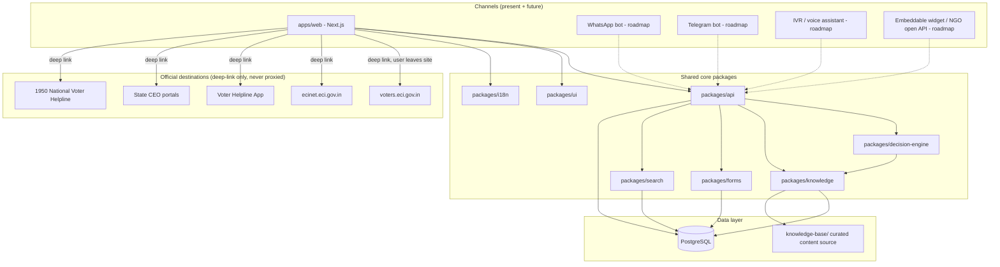

# Technical Architecture

## 1. Architecture Diagram

Dotted lines indicate channels not yet built (roadmap); solid lines
indicate the MVP web path. The critical architectural property is that
**every channel talks to the same `packages/decision-engine` and
`packages/api`** — no channel reimplements decision logic independently.

## 2. Package Responsibilities

| Package | Responsibility |
|---|---|
| `apps/web` | Next.js web application: routing, page composition, calling `packages/api` (or importing `packages/decision-engine` directly server-side for SSR), rendering with `packages/ui` and `packages/i18n` |
| `packages/decision-engine` | Pure, versioned, side-effect-free implementation of the decision tree (`04-decision-tree-spec.md`): given a tree version and an ordered list of answers, deterministically returns the next node or a terminal outcome. No HTTP, no database, no UI. |
| `packages/knowledge` | Knowledge base domain logic: loading, validating (against `09-knowledge-base-schema.md`), and querying KB entries; owns the citation/review-status business rules |
| `packages/i18n` | UI string catalogs, locale negotiation, translation-memory tooling integration (see `11-multilingual-strategy.md`) |
| `packages/ui` | Shared, accessible component library (question card, progress indicator, citation badge, etc. — see `07-design-system.md`) used by `apps/web` and any future web-based channel (e.g., the embeddable widget) |
| `packages/forms` | Metadata and helpers for the official ECI forms (Form 6/6A/7/8/12D): plain-language descriptions, superseded-form mapping, citation links — consumed by both the decision engine's terminal outcomes and the `/learn/forms` KB browser |
| `packages/search` | Full-text search over knowledge base entries (used by `/v1/kb/search`) |
| `packages/api` | HTTP API layer (`10-api-specification.md`) — thin orchestration over `decision-engine`, `knowledge`, `forms`, and `search`; the one place that talks to PostgreSQL directly for read/write of sessions, feedback, etc. |

## 3. Why the Decision Engine Is a Pure, Versioned, Independent Package

This is a deliberate architectural commitment, not an implementation
detail:

1. **Testability.** A pure function (answers in, next-node-or-terminal
   out) is trivially unit-testable and property-testable — see
   `17-test-plan.md`'s requirement that every path terminates and every
   terminal has a citation. Coupling this logic to a web framework, a
   database, or a specific channel's message format would make those
   properties much harder to verify exhaustively.
2. **Channel independence.** WhatsApp/Telegram bots and a future IVR
   channel have entirely different UI/interaction constraints (no rich
   question cards, no visual progress indicator, turn-based text or
   voice) but must produce *identical decision outcomes* for the same
   answers. That's only guaranteed if they all call the same core logic
   rather than each having their own reimplementation that can drift out
   of sync with the legal/procedural content it encodes.
3. **Versioning and auditability.** Because legal/procedural rules change
   (e.g., a future Gazette amendment), the tree itself is versioned
   (`decision_tree_versions` in `08-database-schema.md`). A pure package
   can be semantically versioned and released independently of the web
   app's release cadence, and every session records exactly which tree
   version it ran against — essential for both compliance review and for
   investigating a user's reported "this gave me the wrong answer."
4. **Review surface.** Because the compliance/legal review process
   (`06-legal-compliance-review.md`) needs to review *decision logic
   changes* with the same rigor as content changes, keeping that logic in
   one small, readable package (rather than scattered across
   UI-conditional rendering) makes it reviewable by a non-engineer
   compliance stakeholder reading a diff.

## 4. Future Channels (Roadmap)

- **WhatsApp / Telegram bot** (v2): thin adapters translating the
  bot platform's message format into `packages/api` calls; reuses
  `packages/decision-engine` and `packages/knowledge` unchanged.
- **IVR / voice assistant** (v3): builds on the multilingual voice-mode
  work in `11-multilingual-strategy.md`; the decision engine's
  question/answer structure (small, fixed answer sets per question) was
  chosen partly because it maps cleanly onto DTMF/voice-menu interaction
  patterns, unlike a free-text chatbot design would.
- **Embeddable widget / open API for NGOs** (v2): allows partner
  organizations (civic-tech NGOs, campus groups) to embed a scoped version
  of the decision engine on their own sites via `packages/ui` components
  and the public `packages/api`, under the same non-affiliation and
  citation constraints — governed by an API usage policy to be drafted
  alongside the v2 milestone.
